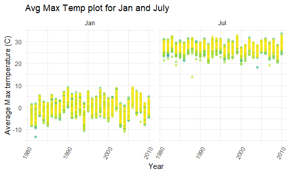
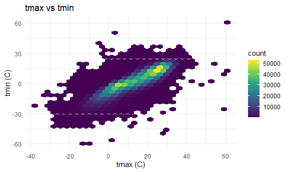
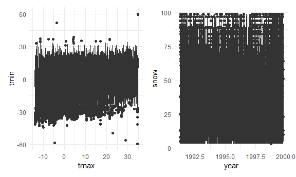

hw3drafting
================

## Problem 0

-   created repository and R project for HW3, created rmd file and
    rending to GitHub.
-   created a sub-directory/ data folder that has all the data set files
    to be used for this HW

``` r
library(tidyverse)
library(readxl)
library(dplyr)
library(ggridges)
library(patchwork)
library(p8105.datasets)
options(tibble.print_min = 5)

knitr::opts_chunk$set(
  fig.width = 6,
  fig.asp = .6,
  out.width = "90%"
)

theme_set(theme_minimal() + theme(legend.position = "bottom"))

options(
  ggplot2.continuous.colour = "viridis",
  ggplot2.continuous.fill = "viridis"
)

scale_colour_discrete = scale_colour_viridis_d
scale_fill_discrete = scale_fill_viridis_d
```

## Problem 1

reading the data

``` r
data("instacart")

instacart = 
  instacart %>% 
  as_tibble(instacart)
```

To see the number of aisles, and the aisles the items were most ordered
from:

``` r
instacart %>% 
  count(aisle) %>% 
  arrange(desc(n))
```

    ## # A tibble: 134 × 2
    ##   aisle                           n
    ##   <chr>                       <int>
    ## 1 fresh vegetables           150609
    ## 2 fresh fruits               150473
    ## 3 packaged vegetables fruits  78493
    ## 4 yogurt                      55240
    ## 5 packaged cheese             41699
    ## # … with 129 more rows

To plot for the number of items ordered in each aisle:

``` r
instacart %>% 
  count(aisle) %>% 
  filter(n > 10000) %>% 
  mutate(aisle = fct_reorder(aisle, n)) %>% 
  ggplot(aes(x = aisle, y = n)) + 
  geom_point() + 
  labs(title = "Number of items ordered in each aisle") +
  theme(axis.text.x = element_text(angle = 60, hjust = 1))
```


To see the three most popular items in each of the aisles “baking
ingredients”, “dog food care”, and “packaged vegetables fruits”:

``` r
instacart %>% 
  filter(aisle %in% c("baking ingredients", "dog food care", "packaged vegetables fruits")) %>%
  group_by(aisle) %>% 
  count(product_name) %>% 
  mutate(rank = min_rank(desc(n))) %>% 
  filter(rank < 4) %>% 
  arrange(desc(n)) %>%
  knitr::kable()
```

| aisle                      | product_name                                  |    n | rank |
|:---------------------------|:----------------------------------------------|-----:|-----:|
| packaged vegetables fruits | Organic Baby Spinach                          | 9784 |    1 |
| packaged vegetables fruits | Organic Raspberries                           | 5546 |    2 |
| packaged vegetables fruits | Organic Blueberries                           | 4966 |    3 |
| baking ingredients         | Light Brown Sugar                             |  499 |    1 |
| baking ingredients         | Pure Baking Soda                              |  387 |    2 |
| baking ingredients         | Cane Sugar                                    |  336 |    3 |
| dog food care              | Snack Sticks Chicken & Rice Recipe Dog Treats |   30 |    1 |
| dog food care              | Organix Chicken & Brown Rice Recipe           |   28 |    2 |
| dog food care              | Small Dog Biscuits                            |   26 |    3 |

To make table showing the mean hour of the day at which Pink Lady Apples
and Coffee Ice Cream are ordered on each day of the week

``` r
instacart %>%
  filter(product_name %in% c("Pink Lady Apples", "Coffee Ice Cream")) %>%
  group_by(product_name, order_dow) %>%
  summarize(mean_hour = mean(order_hour_of_day)) %>%
  spread(key = order_dow, value = mean_hour) %>%
  knitr::kable(digits = 2)
```

| product_name     |     0 |     1 |     2 |     3 |     4 |     5 |     6 |
|:-----------------|------:|------:|------:|------:|------:|------:|------:|
| Coffee Ice Cream | 13.77 | 14.32 | 15.38 | 15.32 | 15.22 | 12.26 | 13.83 |
| Pink Lady Apples | 13.44 | 11.36 | 11.70 | 14.25 | 11.55 | 12.78 | 11.94 |

This data set contains 1384617 rows and 15 columns, with each row
representing a single product from an instacart order. Variables include
identifiers for user, order, and product; the order in which each
product was added to the cart. There are several order-level variables,
describing the day and time of the order, and number of days since prior
order. Then there are several item-specific variables, describing the
product name (e.g. Yogurt, Avocado), department (e.g. dairy and eggs,
produce), and aisle (e.g. yogurt, fresh fruits), and whether the item
has been ordered by this user in the past. In total, there are 39123
products found in 131209 orders from 131209 distinct users.

### Answers

-   There are 134 aisles, and the items were mostly ordered from ‘Fresh
    Vegetables’ and ‘Fresh Fruits’ aisles.
-   Graph plotted for number of items ordered in each aisle
-   The number of times the items were ordered in the aisle:
-   packaged vegetables fruits: organic baby spinach: 9784 times,
    organic raspberries: 5546 times, organic blueberries: 4966 times
-   baking ingredients: light brown sugar: 499 times, pure baking soda:
    387 times, cane sugar: 336 times
-   dog food care: snack sticks chicken and rice recipe dog treats: 30
    times, organic chicken and brown rice recipe: 28 times, small dog
    biscuits: 26 times
-   The mean hour of the day at which Coffee ice cream and Pink lady
    apples was delivered, displayed during the week.

## Problem 2

``` r
acc_ds = read_csv(
    "data/accel_data.csv") %>%
  janitor::clean_names() %>%
  pivot_longer (activity_1:activity_1440,
names_to = "minute_act",
names_prefix = "activity_",
values_to = "physical_activity") %>%
  mutate (minute_act = as.numeric (minute_act),
          wd_vs_wknd = case_when (day == "Monday" ~ "weekday", day == "Tuesday" ~ "weekday", day == "Wednesday" ~ "weekday", day == "Thursday" ~ "weekday", day == "Friday" ~ "weekday", day == "Saturday" ~ "weekend",day == "Sunday" ~ "weekend"))
```

Describing the dataset: - The total number of observations/rows are
**50400** and the total number of variables/columns are **6** - The key
variables in this data set are **week, day_id, day, minute_act,
physical_activity, wd_vs_wknd**

``` r
agg_acc_ds = acc_ds %>%
  select (everything()) %>%
  group_by(week,day) %>%
  summarise (total_activity = sum(physical_activity)) %>%
  pivot_wider(names_from = day,
    values_from = total_activity) %>%
select ("week","Monday","Tuesday","Wednesday","Thursday","Friday","Saturday","Sunday")
```

``` r
plot_acc_ds = acc_ds %>%
  mutate (hour = minute_act/60)


ggplot(plot_acc_ds, aes(x = hour, y = physical_activity, color = day)) + 
  geom_point() + geom_line()
```


## Problem 3

Reading ny_noaa dataset

``` r
data("ny_noaa")

ny_noaa = ny_noaa %>%
 as_tibble (ny_noaa)
```

|                                                  |         |
|:-------------------------------------------------|:--------|
| Name                                             | ny_noaa |
| Number of rows                                   | 2595176 |
| Number of columns                                | 7       |
| \_\_\_\_\_\_\_\_\_\_\_\_\_\_\_\_\_\_\_\_\_\_\_   |         |
| Column type frequency:                           |         |
| character                                        | 3       |
| Date                                             | 1       |
| numeric                                          | 3       |
| \_\_\_\_\_\_\_\_\_\_\_\_\_\_\_\_\_\_\_\_\_\_\_\_ |         |
| Group variables                                  | None    |

Data summary

**Variable type: character**

| skim_variable | n_missing | complete_rate | min | max | empty | n_unique | whitespace |
|:--------------|----------:|--------------:|----:|----:|------:|---------:|-----------:|
| id            |         0 |          1.00 |  11 |  11 |     0 |      747 |          0 |
| tmax          |   1134358 |          0.56 |   1 |   4 |     0 |      532 |          0 |
| tmin          |   1134420 |          0.56 |   1 |   4 |     0 |      548 |          0 |

**Variable type: Date**

| skim_variable | n_missing | complete_rate | min        | max        | median     | n_unique |
|:--------------|----------:|--------------:|:-----------|:-----------|:-----------|---------:|
| date          |         0 |             1 | 1981-01-01 | 2010-12-31 | 1997-01-21 |    10957 |

**Variable type: numeric**

| skim_variable | n_missing | complete_rate |  mean |     sd |  p0 | p25 | p50 | p75 |  p100 | hist  |
|:--------------|----------:|--------------:|------:|-------:|----:|----:|----:|----:|------:|:------|
| prcp          |    145838 |          0.94 | 29.82 |  78.18 |   0 |   0 |   0 |  23 | 22860 | ▇▁▁▁▁ |
| snow          |    381221 |          0.85 |  4.99 |  27.22 | -13 |   0 |   0 |   0 | 10160 | ▇▁▁▁▁ |
| snwd          |    591786 |          0.77 | 37.31 | 113.54 |   0 |   0 |   0 |   0 |  9195 | ▇▁▁▁▁ |

cleaning the data

``` r
ny_noaa_clean = ny_noaa %>%
  janitor::clean_names() %>%
  separate(col= date, into = c("year", "month", "day"), sep ='-', convert = TRUE) %>%
  mutate (month = month.abb[month],
    tmax = as.numeric(tmax),
          tmin = as.numeric(tmin),
          prcp = prcp/10) %>%
  select (id, year, month, day, everything ()) %>%
  mutate (tmax = tmax/10, tmin = tmin/10)
```

|                                                  |               |
|:-------------------------------------------------|:--------------|
| Name                                             | ny_noaa_clean |
| Number of rows                                   | 2595176       |
| Number of columns                                | 9             |
| \_\_\_\_\_\_\_\_\_\_\_\_\_\_\_\_\_\_\_\_\_\_\_   |               |
| Column type frequency:                           |               |
| character                                        | 2             |
| numeric                                          | 7             |
| \_\_\_\_\_\_\_\_\_\_\_\_\_\_\_\_\_\_\_\_\_\_\_\_ |               |
| Group variables                                  | None          |

Data summary

**Variable type: character**

| skim_variable | n_missing | complete_rate | min | max | empty | n_unique | whitespace |
|:--------------|----------:|--------------:|----:|----:|------:|---------:|-----------:|
| id            |         0 |             1 |  11 |  11 |     0 |      747 |          0 |
| month         |         0 |             1 |   3 |   3 |     0 |       12 |          0 |

**Variable type: numeric**

| skim_variable | n_missing | complete_rate |    mean |     sd |     p0 |    p25 |    p50 |    p75 |  p100 | hist  |
|:--------------|----------:|--------------:|--------:|-------:|-------:|-------:|-------:|-------:|------:|:------|
| year          |         0 |          1.00 | 1996.50 |   9.19 | 1981.0 | 1988.0 | 1997.0 | 2005.0 |  2010 | ▆▆▅▅▇ |
| day           |         0 |          1.00 |   15.73 |   8.80 |    1.0 |    8.0 |   16.0 |   23.0 |    31 | ▇▇▇▇▆ |
| prcp          |    145838 |          0.94 |    2.98 |   7.82 |    0.0 |    0.0 |    0.0 |    2.3 |  2286 | ▇▁▁▁▁ |
| snow          |    381221 |          0.85 |    4.99 |  27.22 |  -13.0 |    0.0 |    0.0 |    0.0 | 10160 | ▇▁▁▁▁ |
| snwd          |    591786 |          0.77 |   37.31 | 113.54 |    0.0 |    0.0 |    0.0 |    0.0 |  9195 | ▇▁▁▁▁ |
| tmax          |   1134358 |          0.56 |   13.98 |  11.14 |  -38.9 |    5.0 |   15.0 |   23.3 |    60 | ▁▂▇▆▁ |
| tmin          |   1134420 |          0.56 |    3.03 |  10.40 |  -59.4 |   -3.9 |    3.3 |   11.1 |    60 | ▁▁▇▂▁ |

-   The most commonly observed values for snowfall are 0. It states that
    there was no snowfall on most number of days.

making 2-panel plots for avg max temperature:

``` r
ny_noaa_clean_plot1 =  ny_noaa_clean %>% 
  group_by(id, year, month) %>%
  summarise(tmax_avg = mean(tmax), na.rm = TRUE)%>%
  filter (month %in% c ("Jan", "Jul")) %>%
  ggplot(aes(x = year, y = tmax_avg, color = id)) + 
  geom_point(alpha = 0.5) + 
  theme(legend.position = "none")+
  facet_grid(.~ month)+
  labs(
    title = "Avg Max Temp plot",
    x = "Year",
    y = "Average Max temperature (C)")

ny_noaa_clean_plot1
```



-   

making 2-panel plots for

``` r
tmax_tmin = ny_noaa_clean %>%
  ggplot(aes(x = tmax, y = tmin, fill = id)) + 
  geom_boxplot () + 
  theme (legend.position = "none")

tmax_tmin
```



``` r
snowfall_year = ny_noaa_clean %>%
  filter (snow %in% 1.0:99.0) %>%
  ggplot(aes(x = year, y = snow, fill = id)) + 
  geom_boxplot () + 
  theme(legend.position = "none")

snowfall_year
```


``` r
tmax_tmin + snowfall_year
```


